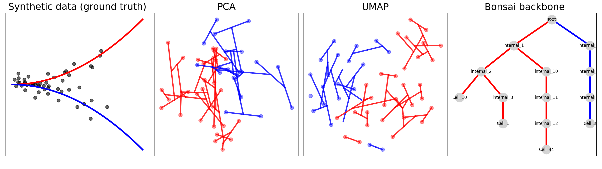

# Topology versus Geometry in Single-Cell Trajectories
### A Demonstration using the Bonsai Algorithm

This repository contains a small demonstrative project exploring the conceptual difference between **geometric embeddings** and **lineage topology reconstruction** in high-dimensional biological data.

The project was created as part of an application for a Computational Research Manager position and serves as a compact demonstration of working with the **Bonsai lineage inference algorithm**.

---

## Concept

In many biological systems, cells evolve through **branching developmental trajectories** in a high-dimensional gene expression space.

Common dimensionality reduction techniques such as:

- PCA
- UMAP

provide geometric visualizations of these state spaces, but they do **not reconstruct ancestral relationships between cells**.

The **Bonsai algorithm** instead aims to reconstruct **lineage topology** directly from high-dimensional measurements.

This project demonstrates the conceptual difference between these two perspectives using a synthetic branching dataset.

---
## Documentation

See the accompanying 

```
report/topology_vs_geometry_bonsai.pdf
```

for further details.

---
## Example result

The figure below compares:

1. The synthetic branching dataset
2. PCA embedding
3. UMAP embedding
4. The inferred Bonsai lineage backbone


Comparison of geometric embeddings (PCA, UMAP) with lineage topology reconstructed by the Bonsai algorithm.
The colored edges projected onto the embeddings correspond to lineage connections inferred by Bonsai.

This illustrates how **topological relationships between cells may differ from geometric proximity in low-dimensional embeddings**.

---

## Repository structure

```
bonsai-lineage-demo/
│
├── Bonsai-data-representation/
├── bonsai_inputs/
├── bonsai_results/
├── bonsai_tmp/
├── data/
├── figures/
│   └── bonsai_overview.png
├── notebooks/
│   └── bonsai_exploration.ipynb
├── patches/
│   └── bonsai_no_resume.patch
├── report/
│   └── topology_vs_geometry_bonsai.pdf
├── src/
│   ├── bonsai_wrapper.py
│   ├── evaluate.py
│   ├── synthetic_data.py
│   └── visualize.py
├── README.md
└── requirements.txt
```


---

## Quick start

```bash
clone this repository
$ git clone https://github.com/franzm64/bonsai-lineage-demo.git

create the necessary Python environment with uv
$ cd bonsai-lineage-demo
$ uv init --python=3.11
$ uv venv
$ source .venv/bin/activate
$ uv pip install -r requirements.txt

get the Bonsai upstream repository, set the version and patch it to make sure the algorithm starts from scratch
$ git clone https://github.com/dhdegroot/Bonsai-data-representation.git
$ cd Bonsai-data-representation
$ git checkout c0ec9948da368b4a069010de41a75e44c03b0800
$ git apply ../../bonsai-lineage-demo/patches/bonsai_no_resume.patch

run the notebook in a browser to create all the partial results and the main 4-panel figure
$ cd ..
$ jupyter notebook notebooks/bonsai_exploration.ipynb
```

In case you wish to place the Bonsai reference implementation elsewhere, then re-set its location in the first cell of the jupyter notebook.

---

## Running the demo

The pipeline in the jupyter notebook performs the following steps:

1. Generate a synthetic branching dataset

2. Compute PCA and UMAP embeddings

3. Run the Bonsai lineage inference pipeline

4. Visualize the inferred lineage structure

---

## References

de Groot et al. (2025) — Bonsai : Tree representations for distortion-free visualization
and exploratory analysis of single-cell omics data. https://www.biorxiv.org/content/10.1101/2025.05.08.652944v1.full.pdf
